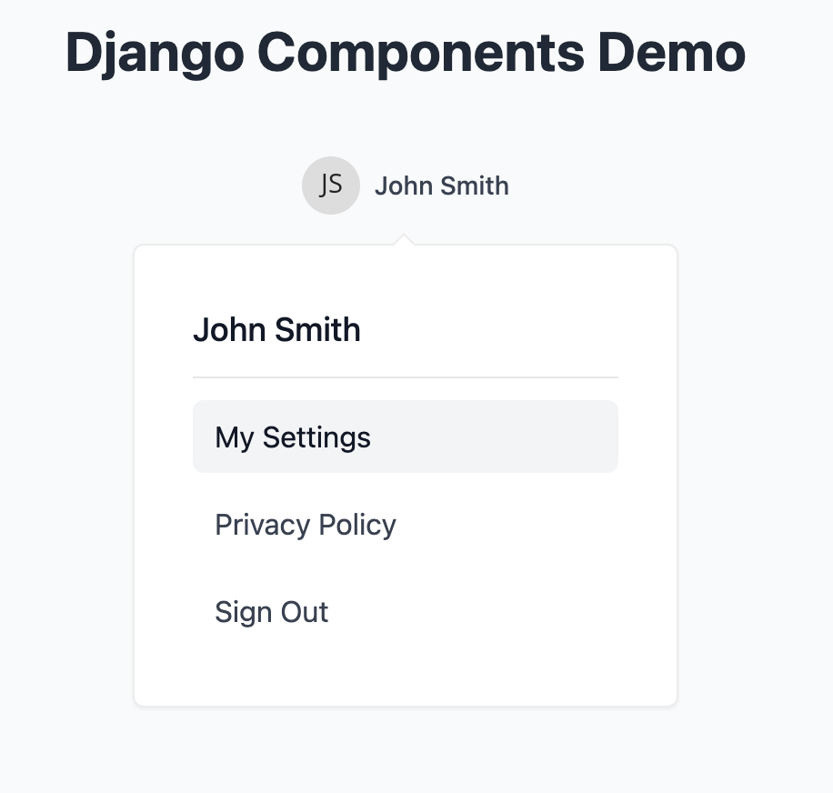

# Popover Component

A reusable Django component that creates an interactive popover menu using Django Components and Alpine.js. The popover provides a clean, modern dropdown interface that can be triggered by any element and can be placed above or below the trigger element.



> Credit: This component was adapted from [Pines UI Popover](https://devdojo.com/pines/docs/popover), a collection of Alpine.js components.

## Prerequisites

Before using this component, make sure you have:

1. Django installed in your project
2. [Django Components](https://github.com/EmilStenstrom/django-components) package installed
3. [Alpine.js](https://alpinejs.dev/) included in your base template
4. [TailwindCSS](https://tailwindcss.com/) for styling (optional, but recommended)

## Installation

1. Add 'django_components' to your `INSTALLED_APPS` in settings.py:
```python
INSTALLED_APPS = [
    ...
    'django_components',
    ...
]
```

2. (Optional) Add the component tags to your template builtins in settings.py:
```python
TEMPLATES = [
    {
        ...,
        'OPTIONS': {
            'builtins': [
                'django_components.templatetags.component_tags',
            ],
            ...
        },
    },
]
```
This step is optional but recommended. Adding `django_components.templatetags.component_tags` to builtins makes all django-components template tags (``, ``, ``, ``, etc.) available in all templates automatically. If you skip this step, you'll need to add `` to any template that uses these tags.

3. Include Alpine.js in your base template:
```html
<script defer src="https://cdn.jsdelivr.net/npm/@alpinejs/focus@3.x.x/dist/cdn.min.js"></script>
<script src="//unpkg.com/alpinejs" defer></script>
```

## Usage

The popover component can be used in any Django template. Here's a basic example:

```html

    
        <button class="px-4 py-2 bg-blue-500 text-white rounded-md">
            Click me
        </button>
    
    
    
        <div class="p-4">
            <h3 class="text-lg font-medium">Custom Content</h3>
            <p>Add any content here!</p>
        </div>
    

```

### Component Properties

- `direction` (optional): Controls the direction of the popover
  - `"below"` (default): Opens the popover below the trigger element
  - `"above"`: Opens the popover above the trigger element

### Slots

1. `trigger`: The element that triggers the popover
   - Can be any HTML element or component
   - When clicked, toggles the popover visibility

2. `content`: The content to show inside the popover
   - Can contain any HTML content
   - Appears when the popover is opened

### Features

- 🎯 Click-away detection to close the popover
- ⌨️ Keyboard support (Escape to close)
- 🎨 Smooth animations using Alpine.js transitions
- 📱 Responsive and mobile-friendly
- 🎯 Automatic arrow positioning
- 🔒 Focus trap when popover is open
- 🎨 Clean, modern styling with TailwindCSS

## Advanced Example

Here's an example showing a user menu with navigation links:

```html

    
        <button class="flex items-center space-x-2 px-4 py-2 text-sm font-medium text-gray-700 hover:text-gray-900">
            
            <span>John Smith</span>
        </button>
    
    
        <div class="p-4">
            <div class="text-lg font-medium text-gray-900">John Smith</div>
            <div class="border-t border-gray-200 my-3"></div>
            <div class="flex flex-col space-y-2">
                <a href="#" class="text-gray-700 hover:text-gray-900 hover:bg-gray-100 px-3 py-2 rounded-md">
                    My Settings
                </a>
                <a href="#" class="text-gray-700 hover:text-gray-900 hover:bg-gray-100 px-3 py-2 rounded-md">
                    Privacy Policy
                </a>
                <a href="#" class="text-gray-700 hover:text-gray-900 hover:bg-gray-100 px-3 py-2 rounded-md">
                    Sign Out
                </a>
            </div>
        </div>
    

```

## How It Works

The popover component uses Alpine.js for interactivity and state management. Here's what's happening under the hood:

1. The component initializes with an Alpine.js data object containing:
   - `popoverOpen`: Boolean state for visibility
   - `direction`: String determining popover position

2. When the trigger is clicked:
   - The `popoverOpen` state toggles
   - The popover appears with a smooth animation
   - Focus is trapped within the popover

3. The popover closes when:
   - Clicking outside the popover (`@click.away`)
   - Pressing the Escape key (`@keydown.escape`)
   - Clicking the trigger again

## Styling

The component comes with default TailwindCSS styling but can be customized by overriding the classes in your implementation. The main styling elements include:

- Popover container: Fixed width (300px), max-width support
- Background: White with a subtle border and shadow
- Smooth transitions for opening/closing
- Responsive arrow that matches the popover's direction
- Hover states for interactive elements

## Accessibility

The popover component includes several accessibility features:

- Focus trap when open (using Alpine.js's `x-trap`)
- Keyboard navigation support
- Proper ARIA attributes
- Semantic HTML structure

## Browser Support

The popover component works in all modern browsers that support:

- Alpine.js (all modern browsers)
- CSS transforms and transitions
- Flexbox layout

## Contributing

Feel free to submit issues and enhancement requests!
